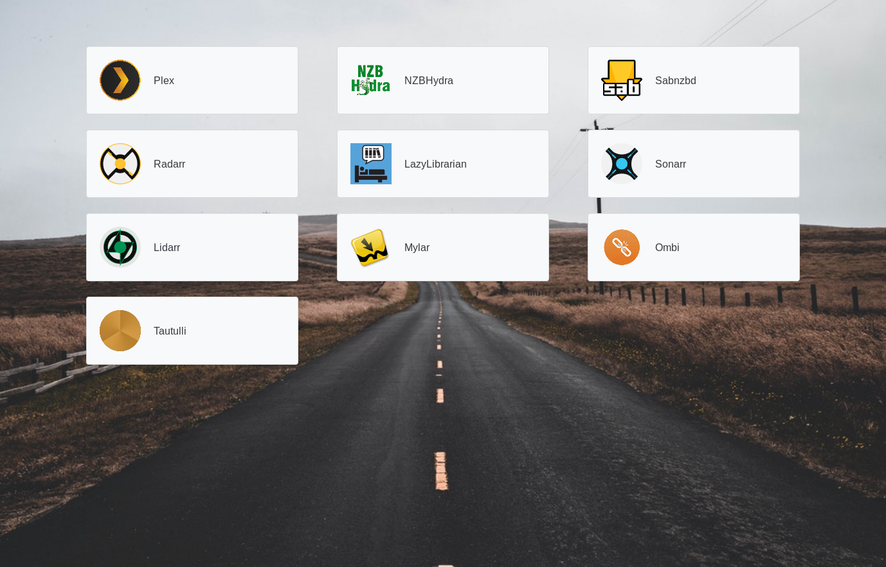

# Indexr

Automated dashboard creation using Docker labels. Designed for use with Docker Compose.

## Use

Label your containers with each of the following:

| Label           	| Purpose                                             	|
|-----------------	|-----------------------------------------------------	|
| `indexr.enable` 	| Whether the service will be added to the dashboard  	|
| `indexr.name`   	| The name the service will have on the dashboard     	|
| `indexr.url`    	| The URL the service link will lead to               	|
| `indexr.icon`   	| The icon of the service (must be in `static/icons`) 	|

If any of the labels are missing, the service will not appear on the dashboard